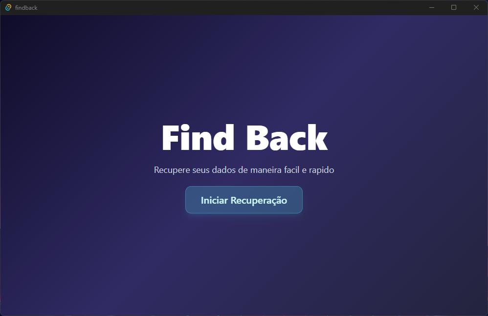
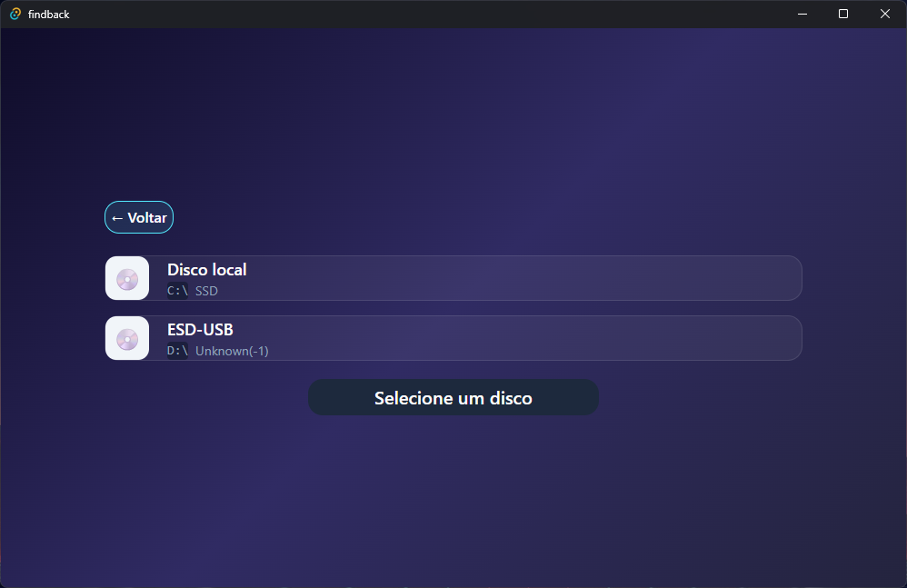
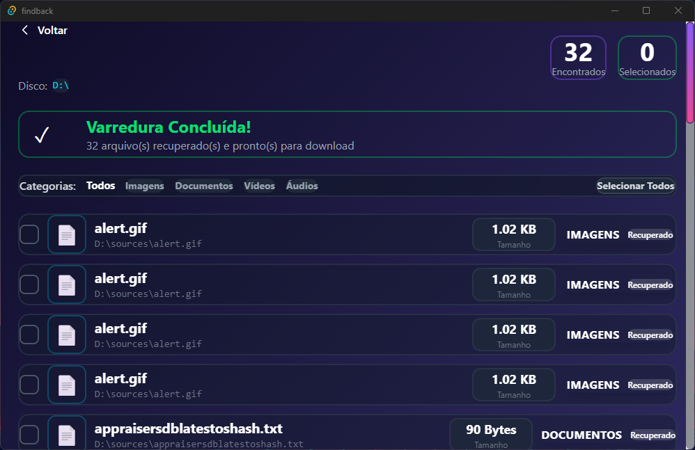

# FindBack

Aplicativo desktop em Tauri + React para localizar e recuperar arquivos deletados, com filtros por categoria (imagens, documentos, videos, audios) e download direto para a pasta escolhida pelo usuario.

## Visao geral

- Front-end: React + TypeScript + Tailwind v4 (utilitario), roteamento com React Router.
- Back-end: Tauri (Rust). Comandos expostos via `invoke` e eventos `file_found` e `scan_complete` para atualizacao em tempo real.
- Fluxo principal: Home -> Selecionar Disco -> Resultados. A varredura ocorre no back-end e envia cada arquivo encontrado para o front, que permite filtrar, selecionar e salvar.

## Executar em modo dev

```bash
cargo tauri dev
```

## Uso

1. Abra o app e escolha um disco na tela "Selecionar Disco".
2. A varredura inicia e envia eventos de arquivos encontrados; eles aparecem em tempo real na tela "Arquivos Recuperados".
3. Use os filtros de categoria (Imagens, Documentos, Videos, Audios) para filtrar a lista.
4. Selecione os arquivos desejados (checkbox ou "Selecionar Todos").
5. Clique em "Baixar" para escolher a pasta de destino; o back-end copia os arquivos recuperados para o local escolhido.





## Principais comandos Tauri (Rust)

- `list_drives`: lista discos e particoes.
- `start_scan`: inicia varredura recursiva do caminho informado, emitindo `file_found` por arquivo e `scan_complete` ao final.
- `save_file`: copia um arquivo recuperado para o destino escolhido.
- `select_folder`: abre dialog nativo para escolher pasta de destino.

## Estrutura de pastas (resumo)

- `src/`: front-end React/TS (paginas, estilos).
- `src/pages/HomePage.tsx`: landing simples.
- `src/pages/SelectDiskPage.tsx`: selecao de disco e inicio da varredura.
- `src/pages/ResultsPage.tsx`: lista arquivos recuperados, filtros e download.
- `src-tauri/src/main.rs`: comandos e logica de varredura/copia.
